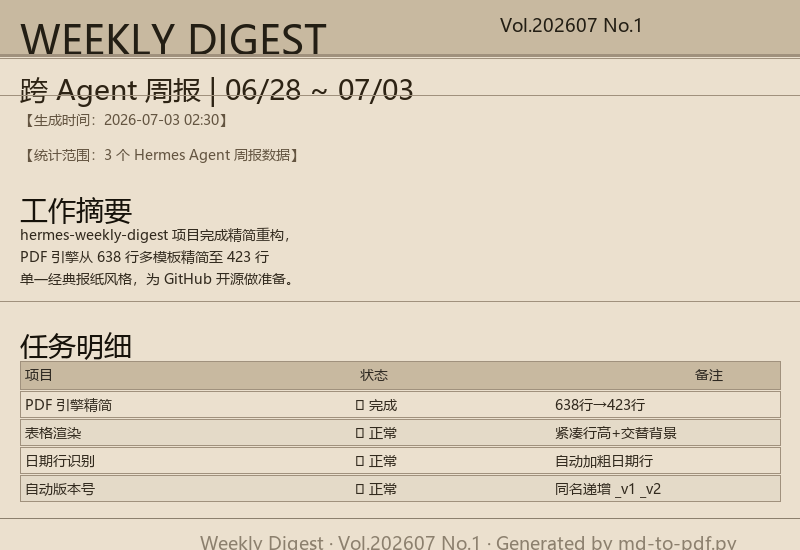

# Hermes Weekly Digest 📊

> v1.0.0 — 跨 Hermes Agent 周报自动生成系统

**扫描所有 Hermes Agent 的会话历史、技能、记忆 → LLM 写叙事总结 → 亚麻纸 PDF + QQ 推送**

> 你同时运行多个 Hermes Agent（比如三个不同人格：分析师、工程师、助手），每周想知道它们各自做了什么、学了什么、有没有出问题？这个项目就是干这个的。

---

## 效果预览

<!-- 以下为实际 PDF 输出效果，由 md-to-pdf.py 生成 -->


**核心特性：**
- 📕 **PDF 报告** — 经典报纸风格（亚麻纸纹理底色、报头、日期自动加粗、紧凑表格交替色）
- 💬 **QQ/微信推送** — 每周一自动送达
- ⚡ **零开销缓存** — 纹理 PNG 只生成一次，后续 PDF 秒级完成

---

## 快速开始

```bash
# 1. 克隆
git clone https://github.com/你的用户名/hermes-weekly-digest.git
cd hermes-weekly-digest

# 2. 安装依赖
pip install -r requirements.txt

# 3. 配置
cp config.example.yaml config.yaml
# 编辑 config.yaml，设置你的 profiles_dir 和 profile_info

# 4. 手动测试
python scripts/weekly-digest.py --force

# 5. 配合 LLM 生成叙事报告（见 workflow.md）

# 6. 设 cron 定时执行（见 docs/workflow.md）
```

---

## 核心文件

| 文件 | 用途 |
|------|------|
| `scripts/weekly-digest.py` | 数据收集引擎 — 直读 Hermes state.db，收集会话/技能/记忆 |
| `scripts/md-to-pdf.py` | PDF 生成器 — Markdown → 经典报纸风格 PDF（亚麻纸纹理） |
| `config.example.yaml` | 配置模板 |
| `docs/setup.md` | 完整安装配置指南 |
| `docs/workflow.md` | LLM 驱动周报流程 + cron 调度 |
| `docs/architecture.md` | 系统架构说明 |

---

## 原理

```
┌──────────────┐    ┌──────────────────┐    ┌──────────────┐
│ Hermes       │    │ weekly-digest.py │    │ LLM Agent    │
│ state.db     │───→│ (每4h, no_agent) │───→│ (读取 JSON,  │
│ (3 profiles) │    │ 输出 JSON 路径   │    │  写叙事报告)  │
└──────────────┘    └──────────────────┘    └──────┬───────┘
                                                   │
                                          ┌────────▼────────┐
                                          │ md-to-pdf.py    │
                                          │ Markdown → PDF  │
                                          └─────────────────┘
```

---

## 与其他工具的关系

本项目是 [Hermes Agent](https://github.com/NousResearch/hermes-agent) 的**配套工具**，不是替代品。它利用 Hermes 的 `state.db`（SQLite 数据库）读取会话记录，配合 Hermes 自身的 cron 调度系统定时执行。

---

## 许可证

MIT
